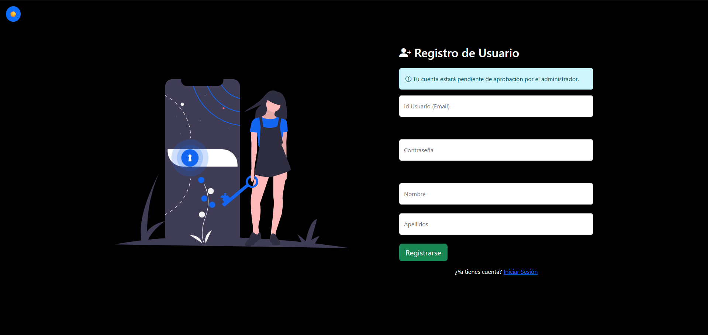
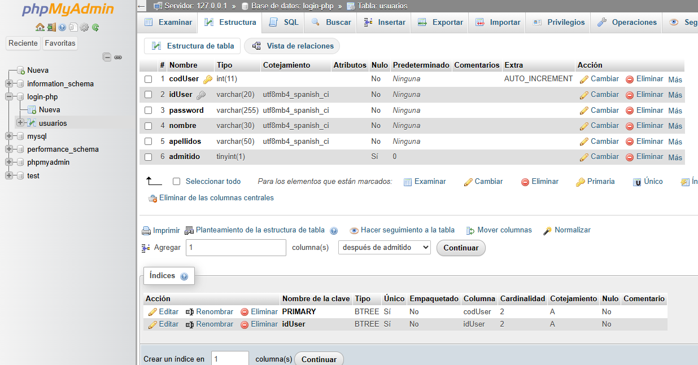

# Ejercicio Práctico N°1 - Aplicación de Login Seguro con PHP y MariaDB

## Modelo-Vista-Controlador (MVC)

Esta aplicación implementa un sistema de login seguro siguiendo el patrón **Modelo-Vista-Controlador**:

|    **Capa**     |                         **Archivos**                         |           **Descripción**           |
| :-------------: | :----------------------------------------------------------: | :---------------------------------: |
|    **Vista**    |          `index.php`, `registro.php`, `inicio.php`           |   HTML del frontend, formularios    |
| **Controlador** | `autentificacion.php`, `procesar_registro.php`, `logout.php` |       Lógica de procesamiento       |
|   **Modelo**    |                     `config_session.php`                     | Configuración de sesión y seguridad |
| **Utilidades**  |                      `validarDatos.js`                       |     Validación del lado cliente     |

### Estructura de Archivos

```
Aplicacion_Login/
├── index.php                  # Vista: Formulario de login
├── registro.php               # Vista: Formulario de registro
├── inicio.php                 # Vista: Página de bienvenida
├── autentificacion.php        # Controlador: Procesa login
├── procesar_registro.php      # Controlador: Procesa registro
├── logout.php                 # Controlador: Cierre de sesión
├── config_session.php         # Modelo: Configuración de seguridad
├── validarDatos.js            # Utilidad: Validación JavaScript
├── añadir_campo_admitido.sql  # Script SQL
└── img/
    └── login.svg
```

---

## Capturas de Pantalla

### Página de Login


### Página de Registro


### Estructura de la Base de Datos


---

## Requisitos del Ejercicio - Preguntas y Respuestas

### 1. Validación Frontend con JavaScript

**Pregunta:** *Valida en el front con JavaScript de los datos de entrada. Pon tamaño mínimo y máximo al idusuario y a la contraseña (entre 8 y 15). Haz que la contraseña tenga mayúsculas, minúsculas, caracteres especiales (pero no ' " \ / < > = ( ) u otros caracteres peligrosos)*

**Respuesta:** Implementado en `validarDatos.js`

```javascript
// Longitud entre 8 y 15 caracteres para el idUser
if (idUser.length < 8 || idUser.length > 15) {
    valido = false;
    mostrarError('idUserHelp', 'El idUser debe tener entre 8 y 15 caracteres');
}

// Longitud entre 8 y 15 caracteres para la contraseña
// NO debe contener caracteres peligrosos: ' " \ / < > = ( )
if (password.length < 8 || password.length > 15 || /['"'"\\/\<>=()]/.test(password)) {
    valido = false;
    mostrarError('passwordHelp', 'La contraseña debe tener entre 8 y 15 caracteres...');
}

// Debe contener mayúscula, minúscula, número y carácter especial
if (!/[A-Z]/.test(password)) { /* error */ }
if (!/[a-z]/.test(password)) { /* error */ }
if (!/[0-9]/.test(password)) { /* error */ }
if (!/[!@#$%^&*_+=\-\[\]{};:,.?]/.test(password)) { /* error */ }
```

**Caracteres especiales PERMITIDOS:** `!@#$%^&*_+-[]{}:,.?`

**Caracteres PROHIBIDOS:** `' " \ / < > = ( )`

---

### 2. Cookies de Sesión Seguras

**Pregunta:** *Asegura las cookies de sesión tal y como hemos visto en la práctica de clase*

**Respuesta:** Implementado en `config_session.php`

```php
session_set_cookie_params([
    'lifetime' => 3600,          // 1 hora de vida
    'path' => '/',               // Disponible en todo el dominio
    'httponly' => true,          // NO accesible via JavaScript (previene XSS)
    'samesite' => 'Strict',      // Previene ataques CSRF
    // 'secure' => true,         // Descomentar en producción (HTTPS)
]);
```

| Parámetro  | Valor    | Seguridad                        |
| ---------- | -------- | -------------------------------- |
| `httponly` | `true`   | Previene robo de cookies por XSS |
| `samesite` | `Strict` | Previene ataques CSRF            |
| `secure`   | `true`   | Solo HTTPS (producción)          |

---

### 3. Token CSRF

**Pregunta:** *Genera un token CSRF, almacénalo como variable de sesión. Pásalo de forma oculta en los formularios y comprueba si coincide antes de ejecutar operaciones*

**Respuesta:** 

**Generación** (`config_session.php`):
```php
if (empty($_SESSION['csrf_token'])) {
    $csrf_token = bin2hex(openssl_random_pseudo_bytes(64));
    $_SESSION['csrf_token'] = $csrf_token;
}
```

**En el formulario** (`index.php`, `registro.php`):
```html
<input type="hidden" name="csrf_token" value="<?php echo htmlspecialchars($_SESSION['csrf_token']); ?>">
```

**Validación** (`autentificacion.php`, `procesar_registro.php`):
```php
if (!isset($_POST["csrf_token"]) || 
    !isset($_SESSION["csrf_token"]) || 
    $_POST["csrf_token"] !== $_SESSION["csrf_token"]) {
    $_SESSION['error'] = "Token CSRF no válido";
    header("Location: index.php");
    die("Solicitud no válida.");
}
```

---

### 4. Eliminar Cookie Antes de Destruir Sesión

**Pregunta:** *Eliminar explícitamente la cookie de sesión antes de destruir ésta al hacer logout*

**Respuesta:** Implementado en `logout.php`

```php
session_unset();                    // 1. Limpiar variables
session_destroy();                  // 2. Destruir sesión

// 3. Eliminar cookie ANTES de destruir
if (ini_get("session.use_cookies")) {
    $params = session_get_cookie_params();
    setcookie(
        session_name(),             // Nombre de la cookie
        '',                         // Valor vacío
        time() - 42000,             // Expiración en el pasado
        $params["path"],
        $params["domain"],
        $params["secure"],
        $params["httponly"]
    );
}
```

---

### 5. Localizar Modificaciones de php.ini

**Pregunta:** *Localizar dónde se modifican los parámetros de configuración de php.ini*

**Respuesta:** En `config_session.php` se modifican los siguientes parámetros de php.ini en tiempo de ejecución:

```php
// Modificamos estos parámetros de php.ini:
// - session.cookie_lifetime  -> 3600
// - session.cookie_path      -> '/'
// - session.cookie_httponly  -> true
// - session.cookie_samesite  -> 'Strict'

session_set_cookie_params([
    'lifetime' => 3600,
    'path' => '/',
    'httponly' => true,
    'samesite' => 'Strict',
]);
```

---

### 6. Tiempo de Expiración de Cookie

**Pregunta:** *Programad y probad que un tiempo de expiración de cookie funciona*

**Respuesta:** Implementado en `config_session.php`

```php
session_set_cookie_params([
    'lifetime' => 3600,  // Cookie expira en 1 hora (3600 segundos)
    ...
]);
```

La cookie de sesión expira automáticamente después de 1 hora de inactividad.

---

### 7. Regeneración de Cookie + Límite 2 Horas

**Pregunta:** *Incluid regeneración de cookie, por ejemplo superados x minutos. Poned también un tiempo límite a la sesión, por ejemplo 2 horas.*

**Respuesta:** Implementado en `config_session.php`

**Regeneración cada 20 minutos:**
```php
$regenerate_interval = 1200;  // 20 minutos

if (!isset($_SESSION['last_regeneration'])) {
    $_SESSION['last_regeneration'] = time();
}

if (time() - $_SESSION['last_regeneration'] >= $regenerate_interval) {
    session_regenerate_id(true);  // Regenera el ID de sesión
    $_SESSION['last_regeneration'] = time();
}
```

**Límite absoluto de 2 horas:**
```php
$session_max_lifetime = 7200;  // 2 horas

if (!isset($_SESSION['session_created'])) {
    $_SESSION['session_created'] = time();
}

if (time() - $_SESSION['session_created'] >= $session_max_lifetime) {
    session_unset();
    session_destroy();
    header("Location: index.php?expired=1");
    exit();
}
```

---

### 8. Control de Intentos de Acceso

**Pregunta:** *Incluid un control de intentos de acceso limitado (por ejemplo, 5 intentos)*

**Respuesta:** Implementado en `autentificacion.php`

```php
$max_attempts = 5;       // Máximo 5 intentos
$lockout_time = 900;     // Bloqueo de 15 minutos

// Inicializar contador
if (!isset($_SESSION['login_attempts'])) {
    $_SESSION['login_attempts'] = 0;
    $_SESSION['first_attempt_time'] = time();
}

// Verificar si está bloqueado
if ($_SESSION['login_attempts'] >= $max_attempts) {
    $time_passed = time() - $_SESSION['first_attempt_time'];
    if ($time_passed < $lockout_time) {
        $remaining = ceil(($lockout_time - $time_passed) / 60);
        $_SESSION['error'] = "Demasiados intentos. Espera {$remaining} minutos.";
        header("Location: index.php");
        exit();
    } else {
        // Reiniciar después del tiempo de bloqueo
        $_SESSION['login_attempts'] = 0;
    }
}

// En cada fallo: $_SESSION['login_attempts']++;
// En éxito: $_SESSION['login_attempts'] = 0;
```

---

### 9. Registro de Usuario

**Pregunta:** *Programad también un posible registro de usuario (en un solo paso)*

**Respuesta:** Implementado en `registro.php` (vista) y `procesar_registro.php` (controlador)

**Características:**
- Validación CSRF
- Validación de servidor (mismos requisitos que cliente)
- Verificación de usuario duplicado
- Contraseña hasheada con `password_hash()`
- Usuario creado con `admitido = 0`

```php
// Hashear contraseña
$passwordHash = password_hash($password, PASSWORD_DEFAULT);

// Insertar con admitido = 0
$insertSQL = "INSERT INTO usuarios (idUser, password, nombre, apellidos, admitido) 
              VALUES (?, ?, ?, ?, 0)";
```

---

### 10. Auto-registro con Autorización Admin

**Pregunta:** *Si hacemos que el auto registro requiera la autorización de admin, es necesario incluir un campo adicional, por ejemplo, un booleano "admitido". Los nuevos aspirantes tendrán un valor false.*

**Respuesta:** 

**Modificación de la tabla:**
```sql
ALTER TABLE usuarios ADD COLUMN admitido TINYINT(1) DEFAULT 0;
UPDATE usuarios SET admitido = 1;  -- Usuarios existentes
```

**Verificación en login** (`autentificacion.php`):
```php
if (isset($row['admitido']) && $row['admitido'] != 1) {
    $_SESSION['error'] = "Tu cuenta está pendiente de aprobación por el administrador.";
    header("Location: index.php");
    exit();
}
```

|   **Usuario**    | **Admitido** | **Puede hacer login** |
| :--------------: | :----------: | :-------------------: |
|    Existente     |   1 (true)   |          Sí           |
| Nuevo registrado |  0 (false)   |    No (pendiente)     |

---

## Instalación

1. Clonar/copiar los archivos a `htdocs` o `www`
2. Crear la base de datos `login-php` en MariaDB
3. Crear la tabla `usuarios`:
```sql
CREATE TABLE usuarios (
    idUser VARCHAR(50) PRIMARY KEY,
    password VARCHAR(255) NOT NULL,
    nombre VARCHAR(100),
    apellidos VARCHAR(100),
    admitido TINYINT(1) DEFAULT 0
);
```
4. Insertar un usuario de prueba:
```sql
INSERT INTO usuarios (idUser, password, nombre, apellidos, admitido) 
VALUES ('admin@test.com', '$2y$10$...hash...', 'Admin', 'Test', 1);
```

---

## Tecnologías Utilizadas

- **Backend:** PHP 8.x
- **Base de datos:** MariaDB / MySQL
- **Frontend:** HTML5, CSS3, JavaScript
- **Framework CSS:** Bootstrap 5.3.8
- **Iconos:** Bootstrap Icons, Font Awesome

---

## Autor

- **Nombre:** José Manuel Postigo
- **Asignatura:** Desarrollo Web en Entorno Servidor(DWES)
- **Centro:** IES Playamar
- **Fecha:** 12/2025

Proyecto desarrollado como ejercicio de seguridad web con PHP.
